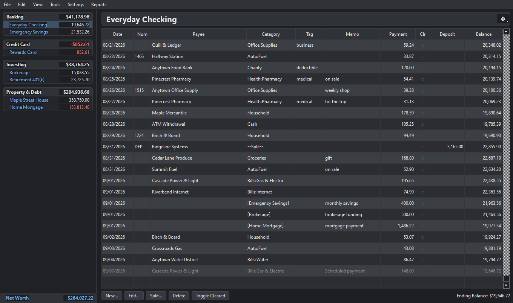
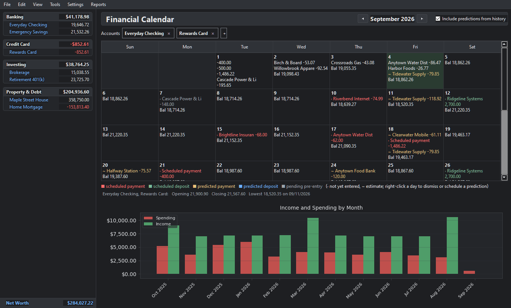
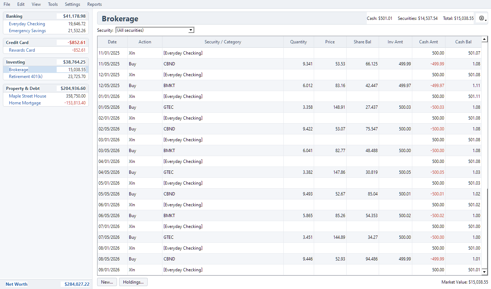
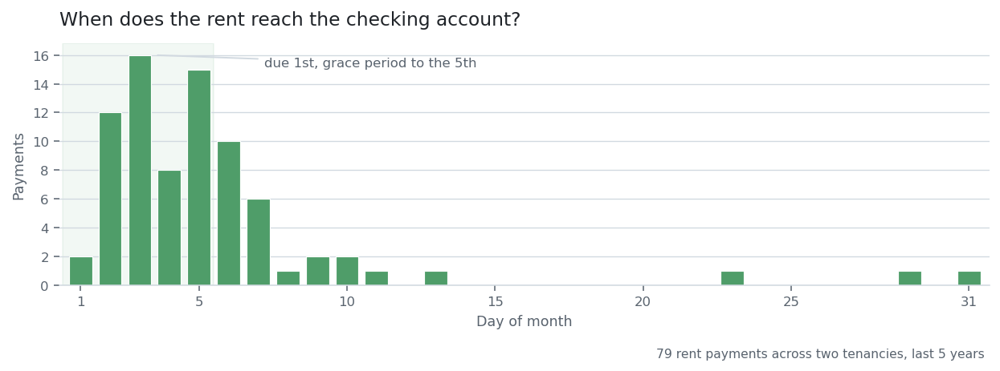

# Mammon

A personal-finance ledger for people who want to own their own data.

Mammon is a Python desktop application (PyQt5) with a classic, dense, keyboard-
friendly account register. Everything it knows lives in one SQLite file on your
disk — a file you can copy, back up, query, and read with any tool that speaks
SQL, or encrypt with a password. There is no cloud, no account, and no
subscription.

It exists because financial history outlives the software that recorded it.

## What it looks like

The register: transfers render as `[Other Account]` rather than a category,
split transactions collapse to `--Split--`, and a scheduled payment that has not
posted yet sits greyed at the bottom of the account it will land in.



The window opens on a financial calendar — a month of what is coming, per
account, with the projected balance on each day and income against spending
below it.



Investment accounts get a register of their own, with share quantities at
`Decimal` precision and a running cash balance beside the share balance. This one
is in the light theme — the two above are dark. Both ship; pick one under
**Settings → Display Preferences**, along with the font, the row shading and the
colour used for negative amounts.



The data in them comes from `--demo` (see [Demo data](#demo-data)).

## Why the name

Mammon is the name I used for my financial database for 40 years. I chose it 
as a continual reminder that money is not my master. 
Now it is an application you can use to master your finances.

## What it does

- **Register** — per-account ledger with inline editing, splits, running
  balances, cleared/reconciled flags, and transfers modelled as two linked
  transactions so totals never double-count.
- **Import** — QIF, OFX/QFX, CSV, and JSON files can all be imported into the register. 
  Columns are automatically identified and if Mammon can't figure them out it runs 
  a wizard where you can help it.
- **Import review** — downloaded transactions are classified NEW or MATCHING and wait
  for you to accept them. Nothing from an account download reaches the register unreviewed.
- **Learning** — Mammon learns payee renaming, categories, and transfer targets
  from your corrections, so the third review needs far less work than the
  first.
- **Investments** — holdings, cost basis, price history, and account valuation,
  with share quantities kept at the downloaded precision.
- **Loans** — amortization with a full interest-rate history, and payments split
  into principal / interest / escrow / other. Auto-recalulated when interest, escrow 
  and payment changes.
- **Scheduled payments** — recurring bills pre-entered as placeholders that the
  real transaction merges into when it posts.
- **Reports** — spending by category, itemized income and expense, net worth
  over time, with charts.
- **Multi-currency** — accounts carry their own currency with a dated FX-rate
  store, so net worth reports per currency or totals through FX into one
  presentation currency. Rates are `Decimal` text, never floats.
- **Backups** — an automatic snapshot every minute, stored as only the database
  pages that changed, so a minute of work costs kilobytes rather than megabytes.
- **Encryption (optional)** — set a password and the whole file is encrypted with
  SQLCipher, backups included. Leave it unset and the file stays plain SQLite.

## Importing from Quicken

Quicken may be able to export the whole file at once for small ledgers, but 
we recommend a **series of one-year QIF exports, imported one at a time in date order**. 
Export each year from Quicken, then import them oldest first:

```
File → Import Quicken File (QIF)…
```

A multi-account QIF import does **not** go through the review queue.
A QIF from Quicken is already curated: its payees and categories come across as
given and land straight in the register. Mammon does not second-guess data you
spent years cleaning up.

Order matters because each year builds on the one before it — accounts, opening
balances and running balances — and because it lets you check what one import
did before loading the next. Re-importing a year you already loaded is safe:
duplicates are matched against what is already there.

`docs/qif_import_research.md` covers what Quicken's own export format does and
does not carry.

## Install

Python 3.12 or newer, on **Windows, macOS or Linux** — it is pure Python on
PyQt5, with no platform-specific code beyond one path-parsing branch. It is
developed and used daily on Windows, and the macOS and Linux paths are currently
untested rather than known-good; the default font is picked per platform, and
everything else should follow. Reports from either are welcome.

From a clone of the repository:

```
pip install -r requirements.txt        # PyQt5 and matplotlib: the app itself
```

Optional extras, installed as a package from the same clone:

```
pip install -e .[mcp,quotes,dev]       # the MCP server, quote download, the tests
pip install -e .[encryption]           # optional database encryption (SQLCipher)
```

An editable install (`pip install -e .`) also puts `mammon` and `mammon-mcp`
commands on your path; `python -m mammon.app` from the repository root works
without installing anything beyond the requirements.

## Running

```
python -m mammon.app
```

The database defaults to `data/mammon.db`, anchored to the install directory —
so the app opens the same file no matter which directory you launch it from.
Point it somewhere else with `--db`:

```
python -m mammon.app --db /path/to/ledger.db
python -m mammon.app --demo          # seed a full demo ledger into an empty database
```

## Demo data

`--demo` seeds a synthetic ledger — around thirty months across checking,
savings, credit card, brokerage, retirement, house and mortgage accounts, with
categories, tags, splits, transfers, price history and scheduled payments. It is
what the screenshots above are taken from.

```
python -m mammon.app --db data\demo.db --demo
```
## Encryption

Optional, and off by default. With no password the ledger is an ordinary SQLite
file.

Set a password under **File → Database Password** and the entire file is 
encrypted with SQLCipher (AES-256): every account, transaction and price, the 
indexes, and the schema. Backups taken from it are encrypted too.

You are asked for the password when the app starts, when you open or restore a
database, and before changing it. It is held in memory for that session only and
written nowhere. **There is no recovery if you forget it.**

Two things worth knowing before you turn it on:

- A backup keeps the password it was written under. After a password change,
  restoring an older backup needs the *old* one.
- Backups saved before you enabled encryption are still plaintext. Mammon
  offers to delete them at that point, and defaults to keeping them.

`docs/encryption.md` has the details, including the MCP server.

## Time savers

The register is built to be quick and responsive, even for 30 year ledgers:

- **Copy the previous split.** Open the split dialog on a payee you have split
  before and it offers *Copy from previous <payee> split*. A paycheck with a
  dozen lines — gross, taxes, deferral, insurance — is one click instead of
  twelve rows of typing.
- **Payee autofill.** Typing a known payee fills the amount, memo, tag and
  category from that payee's last transaction, preferring this account's own.
  If the last one was a transfer, the new row becomes a transfer too.
- **Loan splits correct themselves.** When a rate, an escrow amount, or the
  payment changes, every affected payment is re-split forward — already-posted
  ones included. The total payment is preserved rather than recomputed, so the
  principal / interest / escrow breakdown follows reality without re-entering
  anything.
- **Accept All.** Processes every remaining row in the review queue using the
  learned renames and categories, exactly as accepting them one at a time would.
  So you only have to manually enter the transactions you know Mammon hasn't 
  learned. Then auto accept the rest.
- **One-minute backups.** The auto-backup runs every minute and keeps about two
  hours of restore points, so when you mangle something there is a snapshot from
  a minute before it. Restore from File->Restore from backup.

## Automatic downloads

Mammon can drive your bank's own site through
[webSlinger](https://webslinger.ai) and pull transactions in. Downloaded rows do
not enter the register: they land in a review queue below it, classified NEW or
MATCHING, and wait for you.

Mammon holds **no credentials** — login, MFA and secrets belong entirely to the
webSlinger side, which drives the browser you are already signed in to.

Recording a script is a one-time demonstration: you drive your bank once and
webSlinger replays it after that. Its free plan covers recording, and an
execution-only tier runs your saved scripts for $2/month with the first month
free — so you can record everything you need on the free plan and then switch to
execution-only to use them.

A curated community library of institution scripts is planned, with ratings and
a safety review, so that over time most people will only need to record a script
for an uncommon institution.

## Ask an LLM about your finances (MCP server)

Mammon can serve the ledger to a language model over the Model Context
Protocol, read-only. Every tool returns aggregates first (income vs. expense,
cash flow, spending by category or payee, balances over time, holdings,
upcoming bills, loan terms), with a bounded transaction listing, free-text
search and a read-only SQL tool for the long tail. Account numbers and login
details are never returned.

Requires the `mcp` package (`pip install -e .[mcp]`); the application itself
does not need it. It cannot open an encrypted database, and it refuses one whose
schema is older than the code (open it in Mammon once to migrate) or newer.

### Connecting Claude Code

One command, from anywhere:

```
claude mcp add mammon -- python -m mammon.mcp_server --db /path/to/mammon.db
```

Then ask it things in plain language — `/mcp` lists what it picked up. Add
`--scope user` to make the server available in every project rather than just the
current one.

### Connecting Claude Desktop

Add it to `claude_desktop_config.json` (Settings → Developer → Edit Config) and
restart:

```json
{
  "mcpServers": {
    "mammon": {
      "command": "python",
      "args": ["-m", "mammon.mcp_server", "--db", "C:\\path\\to\\mammon.db"]
    }
  }
}
```

### Connecting anything else

The server speaks standard MCP over stdio, which is what most desktop clients
expect. The shape is always the same — a command and its arguments:

| Client | Where it goes |
|---|---|
| LM Studio | `mcp.json`, same `mcpServers` shape as above |
| Cursor / Windsurf / Zed | the editor's own MCP settings, same shape |
| Anything with an MCP SDK | run the command, speak MCP on stdin/stdout |

A hosted model and a local one connect the same way; which you use is your
choice. To keep everything on your own machine, see below.

### Keeping everything local (Ollama)

Worth being precise here, because it trips people up: **Ollama runs models, it is
not an MCP client.** It has no way to call this server on its own. What you need
is a client that speaks MCP *and* can use Ollama as its model backend — then
nothing leaves your machine, because both halves are local.

Several do. The shape is always the same: point the client at Ollama for the
model, and at the command below for the tools.

```
python -m mammon.mcp_server --db /path/to/mammon.db
```

| Client | Model backend | Notes |
|---|---|---|
| [Open WebUI](https://openwebui.com) | Ollama, natively | MCP arrives through its `mcpo` proxy, which fronts an MCP server as an OpenAPI tool |
| [Goose](https://block.github.io/goose/) | Ollama, configurable | MCP servers are "extensions"; add this one as a command |
| [Continue](https://continue.dev) | Ollama | An IDE extension with MCP support |
| [oterm](https://github.com/ggozad/oterm) | Ollama | A terminal client for Ollama with MCP support |

Each configures MCP servers slightly differently and they all move quickly, so
follow the client's own current documentation for exactly where the command
goes — but the command itself is the one above, and it is the same one Claude
Code and Claude Desktop use.

Pick a model with solid tool-calling. A small one will happily call the wrong
tool, or invent an answer instead of calling anything, and you will not
necessarily notice: the reply looks like the others.

### Over a port

```
python -m mammon.mcp_server --transport streamable-http --port 8765
```

This listens on `127.0.0.1` — your machine only. Something on your own network
could reach the ledger from elsewhere in the house (a phone, say, given a client
to talk to it), but understand what that means first:

> **The server has no authentication of any kind.** Binding it to anything other
> than localhost puts your entire financial history in reach of everything on
> that network, unauthenticated. If you do it, put it behind something that
> authenticates — an SSH tunnel, a reverse proxy, a VPN — and never expose it to
> the open internet.

Read-only is enforced, so nothing reached this way can alter the ledger: the
connection sets `PRAGMA query_only`, and the SQL tool runs under an authorizer
that blanks account numbers, URLs and download configuration.

### What that looks like

Asked in Claude Code, against the author's real ledger:

> *Make a histogram of which day of the month rent reaches my checking account,
> over the last five years.*



Rent is due on the 1st, with a grace period to the 5th, and most of it lands
inside that window.

The tail is not late tenants — it is a measurement artefact, and a good example
of why the question you asked matters. The rent arrives by Venmo, and for most of
this period it only reached the register when somebody remembered to move it
across to checking. The chart is measuring that hop, not the tenants.

Which is the argument for the design Mammon pushes everywhere: give the
intermediary its own account. Then the tenant's payment and the sweep to checking
are two dated events instead of one blurred one, and the same question gets a
real answer.

## Tests

```
python -m pytest mammon/tests -q
```

Qt tests run headless (`QT_QPA_PLATFORM=offscreen`), so no display is needed.
A handful of acceptance tests run only when a real ledger is present; point
`$MAMMON_ACCEPTANCE_DB` at one to include them, otherwise they skip. The
encryption tests skip unless the `encryption` extra is installed.

## Design notes

Money is stored as signed integer cents — never floats. Share quantities and
per-share prices are `Decimal`-precision text. The domain layer
(`mammon/ledger.py`) is the only writer of transaction rows and holds no Qt, so
the invariants that matter are enforced in one place and tested headless. See
`docs/SRD.md` for the full requirements and data model.

## Adding a feature

Contributions are welcome. A few things will make yours land smoothly.

**Read `CLAUDE.md` first.** It sits in the repository root and is the working
guide to this codebase: the layering, the money and date conventions, why the
schema migrations are append-only, and which invariants exist because a specific
bug broke them once. It is written for coding agents and is just as useful to a
person. `docs/SRD.md` is the requirements document of record.

**One feature per branch.**

```
git checkout -b my-feature
```

Keep the branch to a single change. A branch that fixes a bug *and* renames some
things *and* adds a feature is hard to review and impossible to revert cleanly.

**Ground rules**

- **Tests come with the change.** Every behavioural fix lands with a regression
  test in `mammon/tests/`, named after the module it covers. Run the full suite
  before you open a pull request: `python -m pytest mammon/tests -q`
- **`mammon/ledger.py` is the only writer of transaction rows.** Importers, the
  review queue, the loan engine and the UI all go through it, so the transfer
  invariants are enforced in one place. Adding a second write path is the main
  way to break this codebase.
- **Money is signed integer cents. Never floats.** Share quantities and
  per-share prices are `Decimal`-encoded text. Dates are ISO `YYYY-MM-DD` in
  storage and in the domain layer.
- **Never edit an existing migration.** Append a new one — real databases have
  already applied the old ones.
- **Explain *why* in the module docstring**, not just what. The docstrings here
  carry the reasoning, including which bug the current shape prevents. When you
  change behaviour, update that reasoning rather than deleting it.
- **Never commit financial data.** `data/`, `*.db`, `*.qif`, `*.ofx` and `*.qfx`
  are gitignored. The only exception is `mammon/tests/fixtures/`, which is
  synthetic. No real account numbers, no real names — check your test fixtures.
- **Reflect requirement changes into `docs/SRD.md`.**

**Opening a pull request.** Say what it changes and why, and mention anything you
decided against — the reasoning is usually the most useful part of the review.
Small, focused pull requests get read and merged; large ones sit. If you are
planning something substantial, open an issue first so the design can be talked
through before you write it.

## Coming soon

- **Cryptocurrency support** — wallets and exchange accounts as first-class
  holdings, with the same `Decimal` precision the securities path already uses.
- **Investment Center** — one place for allocation, drift against targets and
  rebalancing, instead of reaching them through individual accounts.

## Status

Working and in daily use, but young. The schema is versioned and migrated
forward automatically (`PRAGMA user_version`); back up your database before
upgrading.

## License

GPL-3.0. See [LICENSE](LICENSE).
